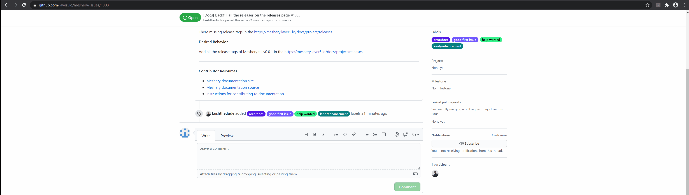

# Self-Censorship Chrome Extension
This chrome extension will automatically censor (by putting ***) profanity words that the user type in text area of any social media website such as Youtube, Facebook, or even Stackoverflow and Github. 

# How to run the program - Workflow guidance
1. Run key_logger.py first
2. Then load the folder package via Google Chrome.
3. By clicking the extension icon, it will set whether to run the extension or not.

